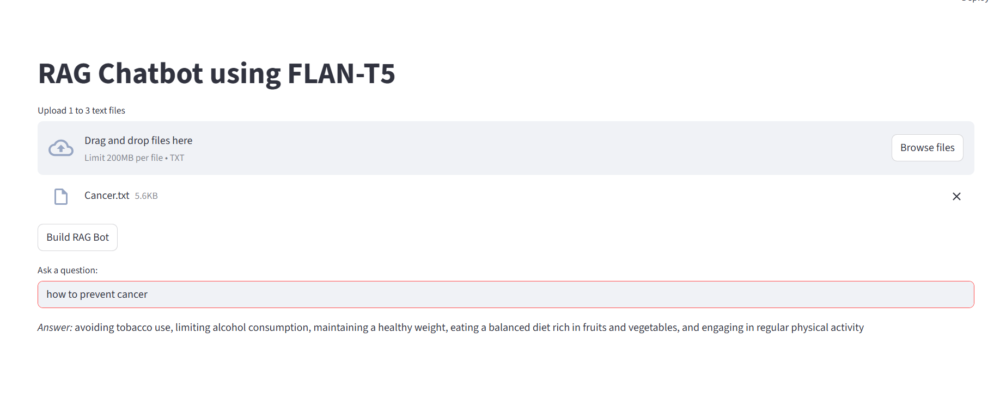

# RAG Chatbot using FLAN-T5 and FAISS

This is a lightweight Retrieval-Augmented Generation (RAG) chatbot built with [Streamlit](https://streamlit.io/) that allows users to upload text file and ask questions based on the content. It uses `FLAN-T5` as the language model, Hugging Face Transformers for NLP tasks, and FAISS for efficient vector-based retrieval.

## 🔧 Features

- Upload  `.txt` file
- Chunk text into manageable pieces using LangChain
- Embed using `all-MiniLM-L6-v2` (via HuggingFace)
- Use FAISS vector store for fast document retrieval
- Generate answers using `google/flan-t5-small`
- Streamlit UI for easy interaction

## 🧪 Demo

